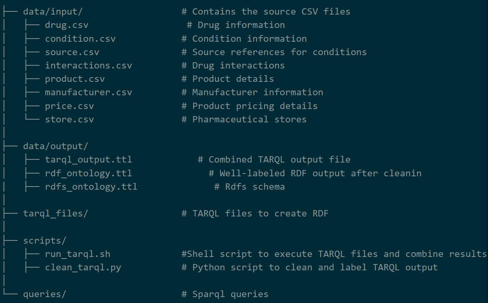

## Project Overview
This project involves the creation and analysis of the **Open Drug Knowledge Graph**, a relational dataset that integrates information about drugs, treatments, conditions, and prices. The project focuses on transforming relational data into a unified RDF knowledge graph, creating and executing queries to interrogate the RDF schema, and subsequently enriching the data using RDFS reasoning.

